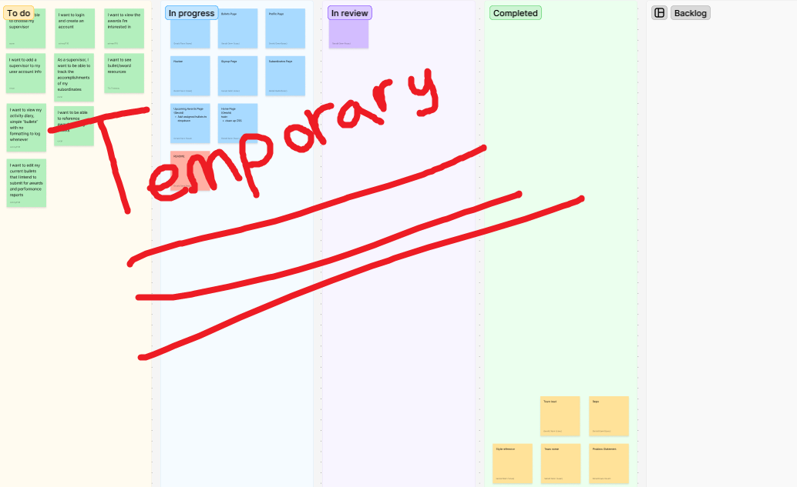

# ReactX
There isn’t a centralized location to draft bullets, regularly track awards and accomplishments, and collab with your supervisor through it all. **ReactX** provides a dashboard for users to create and track award goals, as well as regularly log their notable work activity for performance reporting.

[screenshots here]
---
## How to Download
* ```git clone``` the project URL or download and extract the .ZIP archive.
---
## Requirements
* **NPM**
* **Docker**
* A **PostgreSQL** **Docker** image

### Setup
1. Start a **Docker** **PostgreSQL** *instance* with the following:
    * username: ```postgres```
    * password: ```docker```
    * port: ```5432:5432```
    ```console
    $ docker run --name instance-name -e POSTGRES_PASSWORD=docker -d -p 5432:5432 postgres
    ```
2. Create a database named **bullet** in the **PostgreSQL** *instance*.
   1. ```console
      $ docker exec -it postgres-instance-container-id bash
      ```
   2. ```console
      # psql -U postgres
      ```
   3. ```sql
      # CREATE DATABASE inventory;
      ```
3. Create a ```.env``` in the ```server``` f older with the following contents:
    ```js
    CLIENT_PORT=3000
    SERVER_PORT=3001
    DATABASE_PORT=5432
    USER_NAME=postgres
    USER_PASSWORD=docker
    DATABASE_NAME=bullets
    ```

---
## How to Run

### Front-End Client
From the ```client``` directory, run ```npm i``` to install dependencies then run ```npm run dev``` to start the client.
### Back-End Server
From the ```server``` directory, run ```npm i``` to install dependencies then either run ```npm start``` to rollback, migrate, and seed the database and then start the server or ```npm start``` to only start the server.

## How to Test
**BulletsX** has over 80% test coverage. To run tests, navigate to the appropriate directory (```server``` or ```client```) and run:
```sh
npm run test
```
---

## How to Use
>In order to use **BulletsX**, you create or sign into an account.
### Creating an Account
1. From the **Log In** page, click ***Create Account***. This will redirect you to the **Sign Up** page.
2. Input your *First* and *Last Name* and desired *Username* and *Password*.
3. Select your *Rank/Grade* from the dropdown list.
4. Select your *Rank/Grade* from the dropdown list.
5. Select your *Supervisor*.
6. Click the *Submit* button. If the username is available, your account will be created.

### Logging in
1. From the **Log In** page, input your *Username* and *Password*.
2. Click the *Submit* button. If authenticated, you will be redirected to the **Home** page.

### Navigating the App
  * From the **Home** page, you can:
    * Review **Award-Winning Bullets** and **Upcoming Awards**.
    * Add **Activities**.
    * Navigate to the **Bullets** page.
  * Toggling the **hamburger (☰)** allows you to navigate to:
    * Your **Home** page.
    * Your **Profile** page.
    * Your **Activity** page.
    * Your **Bullets** page.
    * The **Upcoming Awards** page.
    * **My Awards** page.
    * Your **Subordinates** page.
  * Toggling your **Profile** picture also allows you to:
    * Navigate to the **Edit Profile** page.
    * *Log out.*
    * Toggle **Light/Dark Mode**.

More instructions TBD

<!-- ## Tech Stack
**ReactX** combines **Vite** for fast front-end development with **Express** for back-end API handling. It provides a full-stack setup where **Vite** manages the front-end development workflow with hot-reloading, while **Express** serves API routes and static files, ensuring a seamless development experience. This project includes **PostgreSQL** for the database and **Knex.js** as the query builder, simplifying database interactions.

The project also includes automated **testing** with:

-   **Jest** and **Supertest** for back-end API route testing.
-   **Jest** and **React Testing Library** for front-end component testing.

Additionally, it offers **Docker compatibility**, allowing for easy containerized deployment and development. Docker ensures a consistent environment for running the application, simplifying dependency management and deployment.

--- -->

<!-- ## Run Locally

### Prerequisites

Ensure you have the following installed:

-   [Node.js](https://nodejs.org/) (Recommended: v16+)
-   npm (comes with Node.js)
-   Git (to clone the repository)
-   [Docker](https://www.docker.com/)

### 1.  Clone the repository

```sh
  git clone https://github.com/gigann/Bullets-X
```

### 2.  Navigate to the project directory

```sh
  cd Bullets-X
```

### 3.  Run the setup script and follow the prompts

```sh
  ./setup.sh
```

## Running with Node

### 🔹 Start the client

```sh
  npm run dev --prefix ./client
```

### 🔹 Open a new terminal and start the server

```sh
  npm run dev --prefix ./server
```

## Running with Docker

### 🔹 Start the application using Docker

```sh
  docker compose up --build
```

---

## Knex Migrations & Seeding

### Running Migrations & Seeds

Run `./knex.sh` to apply database migrations and seed data:

```sh
  ./knex.sh
```

This executes the following commands in order:

-   `npx knex migrate:rollback` → Rolls back the last migration batch
-   `npx knex migrate:latest` → Runs all pending migrations
-   `npx knex seed:run` → Populates the database with seed data

### Creating Migrations and Seeds

To generate new migration and seed files, run:

```sh
  ./knex.sh <migration_and_seed_name> [additional_migrations_and_seeds...]
```

For example:

```sh
  ./knex.sh roles users
```

This generates the following migration and seed files:

```sh
migrations/
├── 00_20250320193622_roles.js
├── 01_20250320193622_users.js

seeds/
├── 00_roles.js
├── 01_users.js
```

---

## 🛠 Common Issues

When running `./setup.sh`, you may encounter one of these errors:

**❌ Error:**

-   `./setup.sh: Permission denied`
-   `Unknown command. './setup.sh' exists but is not an executable file.`

**Solution:**
Run the following command to grant execute permissions to the setup script:

```sh
  chmod +x setup.sh
```

When running `./knex.sh`, you may encounter one of these errors:

**❌ Error:**

-   `./knex.sh: Permission denied`
-   `Unknown command. './knex.sh' exists but is not an executable file.`

**Solution:**
Run the following command to grant execute permissions to the knex script:

```sh
  chmod +x knex.sh
```

When running Docker with WSL, you may encounter the following error:

**❌ Error:**

`The command 'docker' could not be found in this WSL 2 distro. We recommend to activate the WSL integration in Docker Desktop settings. For details about using Docker Desktop with WSL 2, visit: https://docs.docker.com/go/wsl2/`

`We recommend to activate the WSL integration in Docker Desktop settings. For details about using Docker Desktop with WSL 2, visit: https://docs.docker.com/go/wsl2/`

**Solution:** Enable WSL Integration in Docker Desktop

-   Open Docker Desktop on Windows.
-   Go to Settings > Resources > WSL Integration.
-   Ensure your WSL 2 distribution (e.g., Ubuntu) is enabled.
-   Click Apply & Restart.

--- -->


## Planning and Design
### Problem Statement
There isn’t a centralized location to draft bullets, regularly track awards and accomplishments, and collab with your supervisor through it all. **Our app provides a dashboard for users to create and track award goals, as well as regularly log their notable work activity for performance reporting.**
### User Personas


### Kanban

Made with https://figma.com

### Entity Relationship Diagram (ERD)

Made with https://sql.toad.cz

## Authors
*  [Isaiah Aguirre](https://github.com/isaiahAguirre)
*  [Oscar Avina](https://github.com/ocavina)
*  [Ethan Diem](https://github.com/ethandiem)
*  [Gerald Gann](https://github.com/gigann)
*  [Damon Hayes](https://github.com/DamonHayes)
*  [Ashley Reynolds](https://github.com/ashdrey1110)
*  [Brook Sharpenski](https://github.com/Bsharpenski)
*  [Tia Tomescu](https://github.com/tiatomescu)

## Credits
[Adam Brace](https://github.com/Adam-Brace) for the template.


