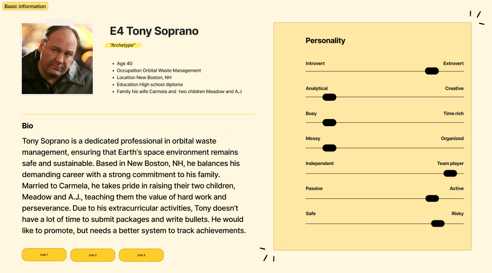
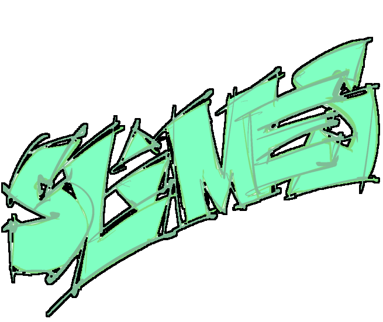

# BulletsX
Built with **React** on the frontend and **Express**, **Knex.js**, and **PostgreSQL** on the backend, **BulletsX** is a fullstack bullet management system, offering bullet drafting, tracking, and reporting capabilities for supervisors and subordinates.

---
## How to Download
* ```git clone``` the project URL or download and extract the .ZIP archive.
---
## Requirements
* **NPM**
* **Docker**
* A **PostgreSQL** **Docker** image

### Setup
1. Start a **Docker** **PostgreSQL** *instance* with the following:
    * username: ```postgres```
    * password: ```docker```
    * port: ```5432:5432```
    ```console
    $ docker run --name instance-name -e POSTGRES_PASSWORD=docker -d -p 5432:5432 postgres
    ```
2. Create a database named **bullet** in the **PostgreSQL** *instance*.
   1. ```console
      $ docker exec -it postgres-instance-container-id bash
      ```
   2. ```console
      # psql -U postgres
      ```
   3. ```sql
      # CREATE DATABASE inventory;
      ```
3. Create a ```.env``` in the ```server``` f older with the following contents:
    ```js
    CLIENT_PORT=3000
    SERVER_PORT=3001
    DATABASE_PORT=5432
    USER_NAME=postgres
    USER_PASSWORD=docker
    DATABASE_NAME=bullets
    ```

---
## How to Run

### Front-End Client
From the ```client``` directory, run ```npm i``` to install dependencies then run ```npm run dev``` to start the client.
### Back-End Server
From the ```server``` directory, run ```npm i``` to install dependencies then either run ```npm start``` to rollback, migrate, and seed the database and then start the server or ```npm start``` to only start the server.

## How to Test
**BulletsX** has over 80% test coverage. To run tests, navigate to the appropriate directory (```server``` or ```client```) and run:
```sh
npm run test
```
---

## How to Use
>In order to use **BulletsX**, you create or sign into an account.
### Creating an Account
1. From the **Log In** page, click ***Create Account***. This will redirect you to the **Sign Up** page.
2. Input your *First* and *Last Name* and desired *Username* and *Password*.
3. Select your *Rank/Grade* from the dropdown list.
4. Select your *Rank/Grade* from the dropdown list.
5. Select your *Supervisor*.
6. Click the *Submit* button. If the username is available, your account will be created.

### Logging in
1. From the **Log In** page, input your *Username* and *Password*.
2. Click the *Submit* button. If authenticated, you will be redirected to the **Home** page.

### Navigating the App
  * From the **Home** page, you can:
    * Review **Award-Winning Bullets** and **Upcoming Awards**.
    * Add **Activities**.
    * Navigate to the **Bullets** page.
  * Toggling the **hamburger (☰)** allows you to navigate to:
    * Your **Home** page.
    * Your **Profile** page.
    * Your **Activity** page.
    * Your **Bullets** page.
    * The **Upcoming Awards** page.
    * **My Awards** page.
    * Your **Subordinates** page.
  * Toggling your **Profile** picture also allows you to:
    * Navigate to the **Edit Profile** page.
    * *Log out.*
    * Toggle **Light/Dark Mode**.

---
## Planning and Design
### Problem Statement
There isn’t a centralized location to draft bullets, regularly track awards and accomplishments, and collab with your supervisor through it all. **Our app provides a dashboard for users to create and track award goals, as well as regularly log their notable work activity for performance reporting.**
### User Personas



### Entity Relationship Diagram (ERD)

Made with https://sql.toad.cz

## Authors

*  [Isaiah Aguirre](https://github.com/isaiahAguirre)
*  [Oscar Avina](https://github.com/ocavina)
*  [Ethan Diem](https://github.com/ethandiem)
*  [Gerald Gann](https://github.com/gigann)
*  [Damon Hayes](https://github.com/DamonHayes)
*  [Ashley Reynolds](https://github.com/ashdrey1110)
*  [Brook Sharpenski](https://github.com/Bsharpenski)
*  [Tia Tomescu](https://github.com/tiatomescu)

## Credits
[Adam Brace](https://github.com/Adam-Brace) for the template.


